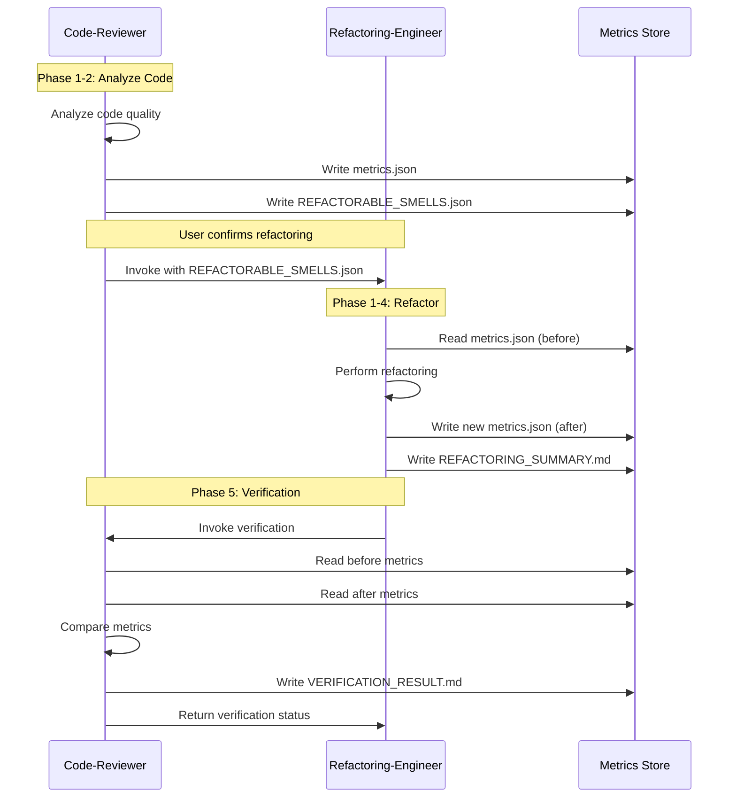

# Metrics Sharing Protocol

**Purpose**: Define how code-reviewer and refactoring-engineer share quality metrics.

**Phase**: Cross-phase (used in all modes)

**Priority**: Important (enables data-driven integration)

**Context**: Standardized metrics enable both agents to make informed decisions

---

## Overview

Code-reviewer and refactoring-engineer share quality metrics via a standardized JSON schema. This enables:
- **Code-Reviewer**: Assess code quality, identify refactorable smells
- **Refactoring-Engineer**: Make data-driven refactoring decisions
- **Verification**: Validate refactorings haven't regressed metrics
- **User Dashboard**: Display quality trends over time

---

## Metrics Schema

### Schema Version: 1.0

**Location**: `shared/integration/metrics-schema.json`

```json
{
  "schema_version": "1.0",
  "timestamp": "2024-01-15T10:30:00Z",
  "project": {
    "name": "example-project",
    "path": "/path/to/project",
    "language": "python",
    "framework": "django"
  },
  "metrics": {
    "code_quality": { ... },
    "test_coverage": { ... },
    "performance": { ... },
    "security": { ... },
    "maintainability": { ... },
    "complexity": { ... }
  },
  "smells": [ ... ],
  "refactoring_opportunities": [ ... ]
}
```

---

## Metric Categories

### 1. Code Quality Metrics

```json
{
  "code_quality": {
    "overall_score": 75,
    "file_count": 120,
    "total_lines": 15000,
    "code_lines": 10000,
    "comment_lines": 2000,
    "blank_lines": 3000,
    "average_file_size": 125,
    "largest_file": {
      "path": "src/services/user_service.py",
      "lines": 500
    },
    "naming_convention_compliance": 95,
    "documentation_coverage": 80
  }
}
```

**Usage**:
- **Code-Reviewer**: Assesses overall code quality
- **Refactoring-Engineer**: Identifies large files for refactoring
- **Verification**: Ensures metrics don't regress

---

### 2. Test Coverage Metrics

```json
{
  "test_coverage": {
    "line_coverage": 88,
    "branch_coverage": 85,
    "function_coverage": 92,
    "test_count": 250,
    "tests_passed": 248,
    "tests_failed": 2,
    "test_runtime_seconds": 12.5,
    "critical_path_coverage": 100,
    "core_logic_coverage": 95,
    "utility_coverage": 82,
    "coverage_by_file": [
      {
        "path": "src/services/user_service.py",
        "line_coverage": 95,
        "branch_coverage": 90,
        "missing_lines": [45, 67, 89]
      }
    ]
  }
}
```

**Usage**:
- **Code-Reviewer**: Identifies coverage gaps
- **Refactoring-Engineer**: Ensures refactorings maintain coverage
- **Verification**: Confirms tests still pass, coverage maintained

---

### 3. Performance Metrics

```json
{
  "performance": {
    "average_response_time_ms": 45,
    "p95_response_time_ms": 120,
    "p99_response_time_ms": 250,
    "database_queries_per_request": 3,
    "n_plus_1_queries": [
      {
        "location": "src/views/orders.py:23",
        "query_count": 101
      }
    ],
    "memory_usage_mb": 250,
    "blocking_io_in_async": [
      {
        "location": "src/handlers/upload.py:12",
        "blocking_call": "db.query()"
      }
    ],
    "algorithmic_complexity": {
      "worst_case": "O(n²)",
      "location": "src/utils/search.py:45"
    }
  }
}
```

**Usage**:
- **Code-Reviewer**: Detects N+1 queries, inefficient algorithms
- **Refactoring-Engineer**: Avoids performance-degrading refactorings
- **Verification**: Ensures no performance regressions

---

### 4. Security Metrics

```json
{
  "security": {
    "vulnerabilities": [
      {
        "type": "sql_injection",
        "severity": "critical",
        "location": "src/services/user_service.py:45",
        "description": "String concatenation in SQL query"
      },
      {
        "type": "xss",
        "severity": "important",
        "location": "src/views/comments.py:23",
        "description": "Unescaped user input in HTML"
      }
    ],
    "vulnerability_count": 2,
    "critical_vulnerabilities": 1,
    "important_vulnerabilities": 1,
    "hardcoded_secrets": 0,
    "insecure_dependencies": 0,
    "authentication_score": 85,
    "authorization_score": 90,
    "input_validation_score": 70
  }
}
```

**Usage**:
- **Code-Reviewer**: Identifies security vulnerabilities
- **Refactoring-Engineer**: Ensures refactorings don't introduce vulnerabilities
- **Verification**: Critical security regression check

---

### 5. Maintainability Metrics

```json
{
  "maintainability": {
    "maintainability_index": 72,
    "average_method_size": 15,
    "longest_method": {
      "location": "src/services/user_service.py:create_user",
      "lines": 60,
      "complexity": 12
    },
    "average_class_size": 120,
    "largest_class": {
      "location": "src/services/payment_service.py:PaymentService",
      "lines": 500,
      "methods": 40
    },
    "duplicate_code_percentage": 5,
    "code_churn_last_month": 15,
    "technical_debt_hours": 40
  }
}
```

**Usage**:
- **Code-Reviewer**: Identifies large methods/classes
- **Refactoring-Engineer**: Targets high-debt code for refactoring
- **Verification**: Confirms maintainability improved

---

### 6. Complexity Metrics

```json
{
  "complexity": {
    "average_cyclomatic_complexity": 5,
    "max_cyclomatic_complexity": 15,
    "high_complexity_functions": [
      {
        "location": "src/services/order_service.py:calculate_price",
        "complexity": 15,
        "threshold": 10
      }
    ],
    "cognitive_complexity": {
      "average": 8,
      "max": 25,
      "high_complexity_functions": [
        {
          "location": "src/utils/validators.py:validate_order",
          "complexity": 25
        }
      ]
    },
    "nesting_depth": {
      "average": 3,
      "max": 7,
      "deep_nesting": [
        {
          "location": "src/services/user_service.py:process_registration",
          "depth": 7
        }
      ]
    }
  }
}
```

**Usage**:
- **Code-Reviewer**: Identifies complex functions
- **Refactoring-Engineer**: Simplifies complex code
- **Verification**: Confirms complexity reduced

---

## Smells Array

```json
{
  "smells": [
    {
      "smell_id": "smell_001",
      "smell_type": "long_method",
      "severity": "suggestion",
      "location": "src/services/user_service.py:10-70",
      "metrics": {
        "lines": 60,
        "complexity": 12,
        "parameters": 3
      },
      "refactorable": true,
      "recommended_refactoring": "extract_method",
      "estimated_time_manual": 30,
      "estimated_time_automated": 5,
      "priority": 3
    },
    {
      "smell_id": "smell_002",
      "smell_type": "duplicate_code",
      "severity": "suggestion",
      "location": "src/services/payment_service.py:45,78,112",
      "metrics": {
        "duplicate_lines": 15,
        "occurrences": 3,
        "total_duplicate_lines": 45
      },
      "refactorable": true,
      "recommended_refactoring": "extract_method",
      "estimated_time_manual": 20,
      "estimated_time_automated": 3,
      "priority": 2
    },
    {
      "smell_id": "smell_003",
      "smell_type": "sql_injection",
      "severity": "critical",
      "location": "src/services/user_service.py:45",
      "metrics": {
        "vulnerability_type": "SQL_INJECTION",
        "exploitability": "high"
      },
      "refactorable": false,
      "recommended_fix": "Use parameterized queries",
      "priority": 1
    }
  ]
}
```

**Smell Fields**:
- `smell_id`: Unique identifier
- `smell_type`: Type of smell (from smell catalog)
- `severity`: critical / important / suggestion
- `location`: File path and line numbers
- `metrics`: Smell-specific metrics
- `refactorable`: Boolean (can be automated)
- `recommended_refactoring` or `recommended_fix`: What to do
- `estimated_time_manual`: Minutes to fix manually
- `estimated_time_automated`: Minutes to fix with automation
- `priority`: 1-5 (1 = highest)

---

## Refactoring Opportunities

```json
{
  "refactoring_opportunities": [
    {
      "opportunity_id": "opp_001",
      "refactoring_type": "extract_method",
      "target": "src/services/user_service.py:create_user",
      "smell_id": "smell_001",
      "roi": {
        "time_saved_minutes": 25,
        "complexity_reduction_percent": 75,
        "readability_improvement": "high"
      },
      "estimated_effort": {
        "manual_minutes": 30,
        "automated_minutes": 5
      },
      "safety": {
        "behavior_preserving": true,
        "risk_level": "low",
        "test_coverage": 88
      },
      "priority": 3
    }
  ]
}
```

**Opportunity Fields**:
- `opportunity_id`: Unique identifier
- `refactoring_type`: Type of refactoring
- `target`: What to refactor
- `smell_id`: Associated smell
- `roi`: Return on investment metrics
- `estimated_effort`: Time estimates
- `safety`: Risk assessment
- `priority`: 1-5

---

## Metrics Exchange

### Code-Reviewer → Refactoring-Engineer

**Scenario**: Code-reviewer detects refactorable smells and offers automation

**Flow**:
1. Code-reviewer performs code review
2. Detects refactorable smells
3. Writes `REFACTORABLE_SMELLS.json` with metrics
4. Offers to invoke refactoring-engineer
5. User confirms
6. Code-reviewer passes `REFACTORABLE_SMELLS.json` to refactoring-engineer

**File: REFACTORABLE_SMELLS.json**
```json
{
  "schema_version": "1.0",
  "timestamp": "2024-01-15T10:30:00Z",
  "smells": [
    {
      "smell_id": "smell_001",
      "smell_type": "long_method",
      "location": "src/services/user_service.py:10-70",
      "metrics": { ... },
      "refactorable": true,
      "recommended_refactoring": "extract_method"
    }
  ],
  "refactoring_opportunities": [ ... ]
}
```

---

### Refactoring-Engineer → Code-Reviewer

**Scenario**: Refactoring-engineer completes refactoring, requests verification

**Flow**:
1. Refactoring-engineer performs refactoring
2. Writes `REFACTORING_SUMMARY.md` with before/after metrics
3. Invokes code-reviewer in Verification Mode
4. Code-reviewer compares before/after metrics
5. Returns `VERIFICATION_RESULT.md`

**File: REFACTORING_SUMMARY.md (includes metrics)**
```markdown
# REFACTORING_SUMMARY.md

## Metrics Comparison

### Before Refactoring
```json
{
  "complexity": {
    "cyclomatic_complexity": 12,
    "cognitive_complexity": 18,
    "nesting_depth": 5
  },
  "maintainability": {
    "method_size": 60,
    "parameters": 3
  },
  "test_coverage": {
    "line_coverage": 88
  }
}
```

### After Refactoring
```json
{
  "complexity": {
    "cyclomatic_complexity": 8,
    "cognitive_complexity": 10,
    "nesting_depth": 3
  },
  "maintainability": {
    "method_size": 15,
    "parameters": 3
  },
  "test_coverage": {
    "line_coverage": 88
  }
}
```
```

---

## Verification Metrics Comparison

### Metrics Delta

```json
{
  "metrics_delta": {
    "complexity": {
      "cyclomatic_complexity": {
        "before": 12,
        "after": 8,
        "delta": -4,
        "percent_change": -33.3,
        "assessment": "IMPROVED"
      },
      "cognitive_complexity": {
        "before": 18,
        "after": 10,
        "delta": -8,
        "percent_change": -44.4,
        "assessment": "IMPROVED"
      }
    },
    "performance": {
      "runtime_ms": {
        "before": 45,
        "after": 43,
        "delta": -2,
        "percent_change": -4.4,
        "assessment": "IMPROVED"
      },
      "memory_mb": {
        "before": 2.3,
        "after": 2.4,
        "delta": 0.1,
        "percent_change": 4.3,
        "assessment": "ACCEPTABLE"
      }
    },
    "test_coverage": {
      "line_coverage": {
        "before": 88,
        "after": 88,
        "delta": 0,
        "percent_change": 0,
        "assessment": "MAINTAINED"
      }
    }
  }
}
```

**Assessment Values**:
- `IMPROVED`: Metric improved (positive change)
- `MAINTAINED`: Metric unchanged (acceptable)
- `ACCEPTABLE`: Minor degradation within threshold
- `DEGRADED`: Significant degradation (warning)
- `REGRESSION`: Unacceptable degradation (failure)

---

## Metrics Thresholds

### Acceptable Thresholds for Verification

```json
{
  "thresholds": {
    "complexity": {
      "cyclomatic_complexity": {
        "max_increase": 0,
        "max_increase_percent": 0
      },
      "cognitive_complexity": {
        "max_increase": 0,
        "max_increase_percent": 0
      }
    },
    "performance": {
      "runtime": {
        "max_increase_percent": 20
      },
      "memory": {
        "max_increase_percent": 10
      },
      "database_queries": {
        "max_increase": 0
      }
    },
    "test_coverage": {
      "line_coverage": {
        "max_decrease": 0
      },
      "branch_coverage": {
        "max_decrease": 0
      }
    },
    "security": {
      "vulnerabilities": {
        "max_new_vulnerabilities": 0
      }
    }
  }
}
```

**Usage**:
- **Verification Mode**: Code-reviewer compares metrics against thresholds
- **SAFE**: All metrics within thresholds
- **UNSAFE**: Any metric exceeds threshold
- **MANUAL_REVIEW**: Borderline (within 5% of threshold)

---

## Metrics Storage

### File Locations

```
project/
├── .code-quality/
│   ├── metrics/
│   │   ├── latest.json                    ← Latest metrics
│   │   ├── 2024-01-15-10-30-00.json       ← Historical metrics
│   │   └── trends.json                    ← Trend analysis
│   ├── smells/
│   │   └── REFACTORABLE_SMELLS.json       ← Detected smells
│   └── refactorings/
│       ├── REFACTORING_SUMMARY.md         ← Refactoring summary
│       └── VERIFICATION_RESULT.md         ← Verification result
```

---

## Metrics API

### Get Latest Metrics

```bash
code-reviewer get-metrics --output=json
```

**Output**:
```json
{
  "schema_version": "1.0",
  "timestamp": "2024-01-15T10:30:00Z",
  "metrics": { ... }
}
```

### Compare Metrics

```bash
code-reviewer compare-metrics \
  --before=.code-quality/metrics/2024-01-01.json \
  --after=.code-quality/metrics/2024-01-15.json \
  --output=delta.json
```

**Output**:
```json
{
  "metrics_delta": { ... }
}
```

### Export Metrics

```bash
code-reviewer export-metrics --format=csv --output=metrics.csv
```

---

## Integration Example

### End-to-End Metrics Flow



---

## Summary

**Metrics Sharing**:
- Standardized JSON schema for quality metrics
- Bidirectional sharing between code-reviewer and refactoring-engineer
- Enables data-driven decisions and verification

**Metric Categories**:
1. Code Quality (file size, naming, documentation)
2. Test Coverage (line, branch, function coverage)
3. Performance (queries, response time, memory)
4. Security (vulnerabilities, compliance scores)
5. Maintainability (method size, complexity, debt)
6. Complexity (cyclomatic, cognitive, nesting)

**Metrics Exchange**:
- Code-Reviewer → Refactoring-Engineer: REFACTORABLE_SMELLS.json
- Refactoring-Engineer → Code-Reviewer: REFACTORING_SUMMARY.md (with metrics)
- Code-Reviewer validates: Metrics delta within thresholds

**Priority**: **Important** (enables data-driven integration)
