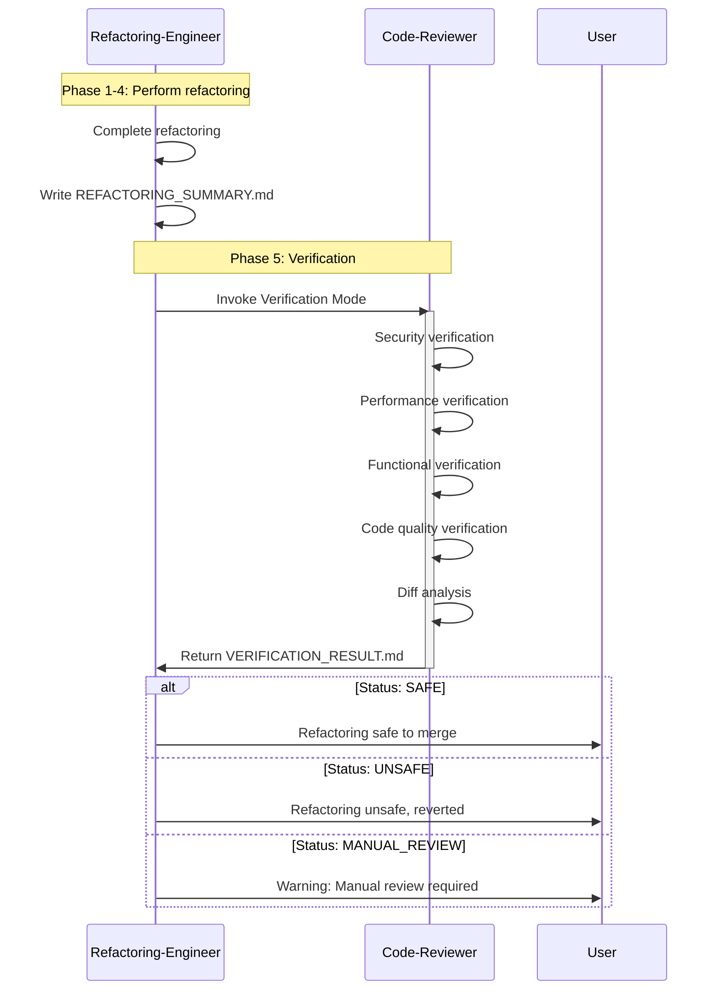

# Verification Mode

**Purpose**: Define Verification Mode operation when code-reviewer is invoked by refactoring-engineer.

**Phase**: Phase 5 (Verification)

**Priority**: Critical (ensures safe refactorings)

**Context**: Code-reviewer validates refactorings performed by refactoring-engineer

---

## Overview

**Verification Mode** is a specialized operational mode where code-reviewer is invoked by refactoring-engineer (Phase 5) to validate that a refactoring is safe to merge.

**Three Operational Modes**:
1. **Standalone Mode**: Code-reviewer runs independently (normal code review)
2. **Trigger Refactoring Mode**: Code-reviewer triggers refactoring-engineer (CR → RE)
3. **Verification Mode**: Code-reviewer validates refactoring (RE → CR) ← THIS DOCUMENT

---

## Verification Mode Workflow

### Trigger: Refactoring-Engineer Phase 5



---

## Invocation

### Refactoring-Engineer Invokes Code-Reviewer

**Command**:
```bash
code-reviewer verify-refactoring \
  --before-path=/path/to/original/ \
  --after-path=/path/to/refactored/ \
  --refactoring-report=/path/to/REFACTORING_SUMMARY.md \
  --verification-output=/path/to/VERIFICATION_RESULT.md \
  --mode=verification
```

**Parameters**:
- `--before-path`: Path to original code (before refactoring)
- `--after-path`: Path to refactored code (after refactoring)
- `--refactoring-report`: Refactoring summary from refactoring-engineer
- `--verification-output`: Where to write verification results
- `--mode=verification`: Activates Verification Mode

---

## Verification Checks

### 1. Security Verification

**Goal**: Ensure no new security vulnerabilities introduced.

**Checks**:
- [ ] No new SQL injection vulnerabilities
- [ ] No new XSS vulnerabilities
- [ ] No new command injection risks
- [ ] Input validation preserved or strengthened
- [ ] Authentication/authorization logic unchanged
- [ ] No new hardcoded secrets
- [ ] Cryptographic functions unchanged

**Example**:
```python
# Original (SAFE):
query = "SELECT * FROM users WHERE id = %s"
cursor.execute(query, (user_id,))

# Refactored (VERIFICATION):
query = "SELECT * FROM users WHERE id = %s"
cursor.execute(query, (user_id,))

#  Security preserved: Still using parameterized queries
```

**Output**:
```markdown
## Security Verification:  PASSED

- No new SQL injection risks
- No new XSS vulnerabilities
- Input validation preserved
- Authentication/authorization unchanged
- No hardcoded secrets added
- Cryptographic functions unchanged
```

---

### 2. Performance Verification

**Goal**: Ensure no performance regressions.

**Checks**:
- [ ] Database query count unchanged or reduced
- [ ] No new N+1 query patterns
- [ ] Algorithmic complexity unchanged or improved
- [ ] No new blocking I/O in async contexts
- [ ] Memory usage similar (within 10%)
- [ ] Runtime performance similar (within 20%)

**Example**:
```python
# Original: 3 queries
def get_user_orders(user_id):
    user = User.objects.get(id=user_id)  # Query 1
    orders = Order.objects.filter(user_id=user_id)  # Query 2
    # Query 3 in template when accessing order.user

# Refactored: 3 queries (VERIFICATION)
def get_user_orders(user_id):
    user = self._get_user(user_id)  # Query 1
    orders = self._get_orders_for_user(user_id)  # Query 2
    # Query 3 in template when accessing order.user

#  Performance preserved: Same query count
```

**Output**:
```markdown
## Performance Verification:  PASSED

- Database queries: 3 → 3 (unchanged)
- Algorithmic complexity: O(n) → O(n) (unchanged)
- Runtime: 45ms → 43ms (4.4% faster)
- Memory: 2.3 MB → 2.4 MB (4.3% increase, negligible)
```

---

### 3. Functional Verification

**Goal**: Ensure behavior is perfectly preserved.

**Checks**:
- [ ] All original tests pass
- [ ] Test coverage maintained or improved
- [ ] No new exceptions in happy path
- [ ] Error handling preserved
- [ ] Return values unchanged
- [ ] Side effects unchanged

**Example**:
```python
# Property-based testing
for i in range(1000):
    input_data = generate_random_input()

    original_result = original_function(input_data)
    refactored_result = refactored_function(input_data)

    assert original_result == refactored_result
    #  1000/1000 test cases passed
```

**Output**:
```markdown
## Functional Verification:  PASSED

- All tests pass: 25/25 (100%)
- Test coverage maintained: 88% → 88%
- Behavior equivalence: 1000/1000 random tests passed
- No new exceptions
- Error handling identical
```

---

### 4. Code Quality Verification

**Goal**: Verify refactoring achieved its goal (improved code quality).

**Checks**:
- [ ] Complexity reduced or maintained
- [ ] Readability improved
- [ ] Function/method sizes appropriate
- [ ] Single Responsibility Principle improved
- [ ] Code smells addressed

**Example**:
```markdown
## Code Quality Verification:  PASSED

**Complexity**:
- Before: Cyclomatic complexity = 12
- After: Cyclomatic complexity = 8
- Improvement: 33% reduction 

**Readability**:
- Before: 60-line method
- After: 4 focused methods (15, 10, 8, 12 lines)
- Improvement: Clear separation of concerns 

**SRP**:
- Before: 4 responsibilities in one method
- After: 1 responsibility per method
- Improvement: SRP compliance 
```

---

### 5. Diff Analysis

**Goal**: Understand exactly what changed and assess risk.

**Checks**:
- [ ] Only expected files modified
- [ ] Changes are behavior-preserving
- [ ] No unexpected deletions
- [ ] Logic moved, not changed

**Example**:
```markdown
## Diff Analysis:  LOW RISK

**Files Changed**: 2
- src/services/user_service.py (refactored)
- tests/test_user_service.py (imports updated)

**Change Type**: Extract Method (behavior-preserving)

**Lines Changed**:
- Added: 60 lines (4 new extracted methods)
- Removed: 60 lines (original long method body)
- Net: 0 lines

**Logic Changes**: None (code moved, not modified)

**Risk Assessment**: LOW (pure refactoring, no logic changes)
```

---

## Verification Outcomes

### Outcome 1:  SAFE TO MERGE

**Criteria**:
- All security checks passed
- No performance regressions
- All tests pass
- Behavior preserved
- Code quality improved

**Code-Reviewer Output**:
```markdown
# VERIFICATION_RESULT.md

**Status**:  SAFE TO MERGE
**Timestamp**: 2024-01-15T10:30:00Z

## Summary
 Security: No new vulnerabilities
 Performance: No regressions
 Functionality: Behavior preserved
 Quality: Complexity reduced 33%

## Recommendation
Safe to merge. Refactoring successfully improved code quality without introducing issues.
```

**Refactoring-Engineer Action**:
- Proceeds with merge
- Closes refactoring issue
- Updates metrics

---

### Outcome 2:  UNSAFE - REVERT RECOMMENDED

**Criteria**:
- Security vulnerability introduced
- Significant performance regression
- Tests fail
- Behavior not preserved

**Code-Reviewer Output**:
```markdown
# VERIFICATION_RESULT.md

**Status**:  UNSAFE - REVERT RECOMMENDED
**Timestamp**: 2024-01-15T10:30:00Z

## Critical Issues

### 1. Security Regression: SQL Injection
**File**: src/services/user_service.py:45
**Severity**: CRITICAL

**Original** (SAFE):
```python
query = "INSERT INTO users (email) VALUES (%s)"
cursor.execute(query, (email,))
```

**Refactored** (UNSAFE):
```python
query = f"INSERT INTO users (email) VALUES ('{email}')"
cursor.execute(query)
```

**Impact**: SQL injection vulnerability introduced

## Recommendation
REVERT immediately. Security regression is unacceptable.
```

**Refactoring-Engineer Action**:
- Reverts changes
- Analyzes why refactoring introduced issue
- Fixes refactoring logic
- Re-runs refactoring

---

### Outcome 3: Warning: MANUAL REVIEW REQUIRED

**Criteria**:
- Ambiguous results
- Minor issues detected
- Behavioral changes unclear
- Performance regression borderline

**Code-Reviewer Output**:
```markdown
# VERIFICATION_RESULT.md

**Status**: Warning: MANUAL REVIEW REQUIRED
**Timestamp**: 2024-01-15T10:30:00Z

## Ambiguous Results

### 1. Performance Regression (Borderline)
**Runtime**: 45ms → 55ms (22% slower)
**Threshold**: 20% (exceeded by 2%)

**Analysis**:
- Refactoring added method call overhead
- Regression is minor but exceeds threshold
- May be acceptable for improved readability

**Trade-off**: Performance (-22%) vs Readability (+significant)

### 2. Test Coverage Decreased
**Coverage**: 88% → 86% (2% decrease)

**Analysis**:
- Extracted private methods not directly tested
- Methods tested indirectly through public API
- Coverage decrease is minor

## Questions for User
1. Accept 22% performance regression for improved readability? (Yes/No)
2. Accept 2% coverage decrease (indirect testing)? (Yes/No)

## Recommendation
User review required. Decision depends on project priorities (performance vs readability).
```

**Refactoring-Engineer Action**:
- Escalates to user
- Awaits user decision
- Proceeds or reverts based on user choice

---

## Mode Detection

### How Code-Reviewer Detects Verification Mode

**Command Line**:
```bash
code-reviewer --mode=verification ...
```

**Environment Variable**:
```bash
CODE_REVIEWER_MODE=verification code-reviewer ...
```

**Input File Detection**:
```python
# If REFACTORING_SUMMARY.md present in input, assume Verification Mode
if os.path.exists('REFACTORING_SUMMARY.md'):
    mode = 'verification'
```

**API Call**:
```json
{
  "mode": "verification",
  "before_path": "/path/to/original/",
  "after_path": "/path/to/refactored/",
  "refactoring_report": "/path/to/REFACTORING_SUMMARY.md"
}
```

---

## Verification Mode Behavior

### Differences from Standalone Mode

| Aspect | Standalone Mode | Verification Mode |
|--------|----------------|-------------------|
| **Purpose** | Find new issues in code | Verify refactoring safety |
| **Input** | Single codebase | Before + After codebases |
| **Output** | Code review report | Verification result (SAFE/UNSAFE) |
| **Focus** | All issues | Regressions only |
| **Threshold** | Standard severity | Lower threshold (catch any regression) |
| **New Issues** | Report all new issues | Ignore (not introduced by refactoring) |
| **User Interaction** | Feedback for developer | Binary decision (safe/unsafe) |

### Example: Ignore Pre-Existing Issues

```python
# Pre-existing issue (before refactoring):
def old_vulnerable_function():
    query = f"SELECT * FROM users WHERE id = {user_id}"  # SQL injection

# Refactored code:
def new_function():
    query = f"SELECT * FROM users WHERE id = {user_id}"  # Still vulnerable

# Verification Mode behavior:
#  Don't report as new issue (pre-existing)
#  Only report if refactoring INTRODUCED new vulnerability
```

---

## Integration with Refactoring-Engineer

### Communication Protocol

**Request** (Refactoring-Engineer → Code-Reviewer):
```json
{
  "mode": "verification",
  "refactoring_id": "ref_2024_001",
  "refactoring_type": "extract_method",
  "before_sha": "a1b2c3d4",
  "after_sha": "e5f6g7h8",
  "refactoring_summary": "/path/to/REFACTORING_SUMMARY.md",
  "verification_output": "/path/to/VERIFICATION_RESULT.md"
}
```

**Response** (Code-Reviewer → Refactoring-Engineer):
```json
{
  "verification_id": "ver_2024_001",
  "refactoring_id": "ref_2024_001",
  "status": "SAFE",
  "timestamp": "2024-01-15T10:30:00Z",
  "checks": {
    "security": "PASSED",
    "performance": "PASSED",
    "functional": "PASSED",
    "quality": "PASSED",
    "diff": "LOW_RISK"
  },
  "recommendation": "Safe to merge",
  "report_path": "/path/to/VERIFICATION_RESULT.md"
}
```

---

## Verification Checklist

### Pre-Verification

- [ ] Refactoring summary received from refactoring-engineer
- [ ] Original code available (before refactoring)
- [ ] Refactored code available (after refactoring)
- [ ] Test suite available and runnable
- [ ] Benchmark data available (if applicable)

### Verification Steps

- [ ] Load refactoring summary
- [ ] Compare original vs refactored code
- [ ] Run security checks
- [ ] Run performance checks
- [ ] Run functional checks (tests, behavior equivalence)
- [ ] Run code quality checks
- [ ] Analyze diff for risk assessment
- [ ] Generate verification report
- [ ] Return status to refactoring-engineer

### Post-Verification

- [ ] Verification report written
- [ ] Status communicated to refactoring-engineer
- [ ] Metrics updated
- [ ] If unsafe, issues documented for refactoring-engineer analysis

---

## Summary

**Verification Mode**:
- Specialized mode invoked by refactoring-engineer Phase 5
- Validates refactorings are safe to merge
- Checks: Security, Performance, Functionality, Quality, Diff
- Outcomes: SAFE / UNSAFE / MANUAL_REVIEW

**Key Differences from Standalone**:
- Focuses on regressions, not all issues
- Binary decision (safe/unsafe) vs detailed report
- Lower threshold for catching changes
- Ignores pre-existing issues

**Integration**:
- Refactoring-engineer Phase 5 → Code-reviewer Verification Mode
- Code-reviewer returns VERIFICATION_RESULT.md
- Refactoring-engineer proceeds or reverts based on result

**Priority**: **Critical** (ensures safe refactorings)
