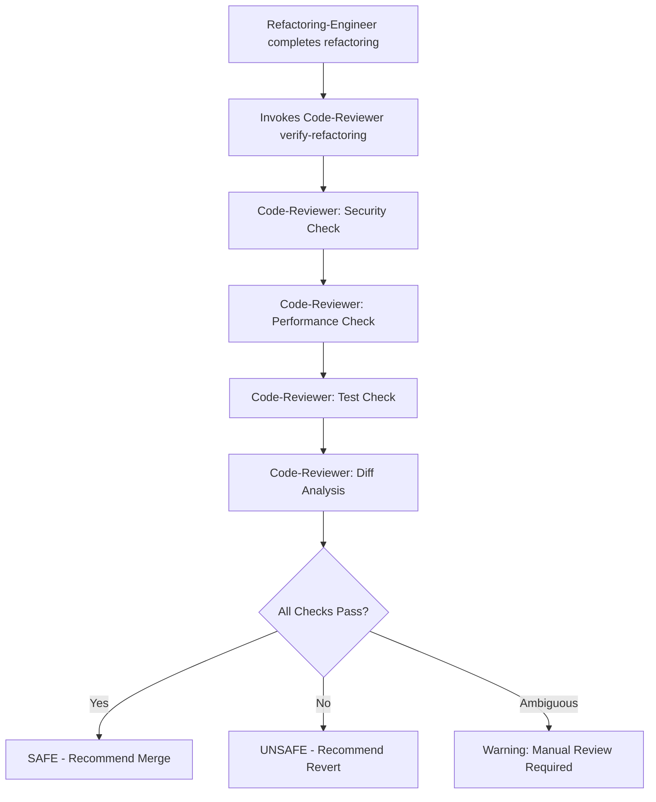

# Verification Commands

**Purpose**: Document verification commands used when code-reviewer operates in Verification Mode.

**Phase**: Phase 5 (Verification Mode)

**Priority**: Critical (ensures refactorings are safe)

**Context**: Code-reviewer is invoked by refactoring-engineer Phase 5 to verify refactorings

---

## Overview

Verification Mode is a specialized operational mode where code-reviewer validates refactorings performed by refactoring-engineer. Instead of finding new issues, code-reviewer ensures:
- **No New Bugs**: Refactoring didn't break functionality
- **No Security Regressions**: No new security vulnerabilities introduced
- **No Performance Regressions**: Performance not degraded
- **Behavior Preserved**: Code behavior unchanged

---

## Verification Commands

### Command 1: `verify-refactoring`

**Purpose**: Full verification of refactoring changes.

**Invocation**:
```bash
code-reviewer verify-refactoring \
  --before-path=/path/to/original/ \
  --after-path=/path/to/refactored/ \
  --refactoring-report=/path/to/REFACTORING_SUMMARY.md \
  --verification-output=/path/to/VERIFICATION_RESULT.md
```

**Parameters**:
- `--before-path`: Original code directory
- `--after-path`: Refactored code directory
- `--refactoring-report`: Refactoring engineer's summary
- `--verification-output`: Where to write verification results

**Output Format**:
```markdown
# Refactoring Verification Report

**Refactoring**: Extract Method (UserService.create_user → 3 extracted methods)
**Status**:  SAFE /  UNSAFE

## Summary
- No new bugs detected
- No security regressions
- No performance regressions
- Behavior preserved

## Detailed Analysis

### 1. Functionality Check
 All original functionality preserved
 No new exceptions introduced
 Return values unchanged

### 2. Security Check
 No new SQL injection risks
 No new XSS vulnerabilities
 Authentication/authorization unchanged

### 3. Performance Check
 No new N+1 queries
 Algorithmic complexity unchanged (O(n) → O(n))
 No new blocking I/O

### 4. Test Coverage
 All original tests pass
 Test coverage maintained (88% → 88%)

## Recommendations
- Refactoring is SAFE to merge
- Consider adding tests for extracted methods
```

**Exit Codes**:
- `0`: Verification passed (safe to merge)
- `1`: Verification failed (unsafe, revert recommended)
- `2`: Manual review required (ambiguous results)

---

### Command 2: `verify-security`

**Purpose**: Security-focused verification (subset of full verification).

**Invocation**:
```bash
code-reviewer verify-security \
  --before-path=/path/to/original/ \
  --after-path=/path/to/refactored/ \
  --output=/path/to/security-verification.md
```

**Focus Areas**:
- SQL injection regression check
- XSS regression check
- Authentication/authorization changes
- Input validation changes
- Cryptographic changes
- Hardcoded secrets (new occurrences)

**Output Format**:
```markdown
# Security Verification Report

**Status**:  SAFE / Warning: REVIEW REQUIRED /  UNSAFE

## Security Checks

### 1. Injection Vulnerabilities
 No new SQL injection risks
 No new command injection risks
 No new XSS vulnerabilities

### 2. Authentication & Authorization
 No changes to auth logic
 Access control unchanged

### 3. Cryptography
 No crypto changes
 No hardcoded secrets added

### 4. Input Validation
Warning: REVIEW REQUIRED: Input validation moved from UserService to UserValidator
- Original: Validated email in create_user()
- Refactored: Validation in UserValidator.validate_email()
- Assessment: Equivalent validation, but verify UserValidator is called

## Recommendation
Manual review recommended: Verify UserValidator is invoked before user creation
```

---

### Command 3: `verify-tests`

**Purpose**: Test-focused verification.

**Invocation**:
```bash
code-reviewer verify-tests \
  --before-path=/path/to/original/ \
  --after-path=/path/to/refactored/ \
  --test-results=/path/to/test-results.json \
  --output=/path/to/test-verification.md
```

**Checks**:
- All original tests pass
- Test coverage maintained or improved
- No flaky tests introduced
- Test performance acceptable

**Output Format**:
```markdown
# Test Verification Report

**Status**:  PASSED /  FAILED

## Test Results

### Before Refactoring
- Tests: 120 total, 120 passed, 0 failed
- Coverage: 88% (220/250 lines)
- Runtime: 2.3 seconds

### After Refactoring
- Tests: 120 total, 120 passed, 0 failed
- Coverage: 88% (220/250 lines)
- Runtime: 2.1 seconds

### Analysis
 All tests pass (120/120)
 Coverage maintained (88% → 88%)
 Performance improved (2.3s → 2.1s)

## New Test Gaps (if any)
Warning: Extracted methods not directly tested:
- UserService._validate_email() (called indirectly)
- UserService._normalize_name() (called indirectly)

## Recommendation
 Safe to merge
Consider adding unit tests for extracted private methods
```

---

### Command 4: `verify-performance`

**Purpose**: Performance-focused verification.

**Invocation**:
```bash
code-reviewer verify-performance \
  --before-path=/path/to/original/ \
  --after-path=/path/to/refactored/ \
  --benchmark-results=/path/to/benchmarks.json \
  --output=/path/to/performance-verification.md
```

**Checks**:
- No new N+1 queries
- Algorithmic complexity unchanged
- No new blocking I/O in async contexts
- Database query count unchanged
- Memory usage similar

**Output Format**:
```markdown
# Performance Verification Report

**Status**:  NO REGRESSIONS / Warning: MINOR REGRESSION /  SIGNIFICANT REGRESSION

## Performance Metrics

### Database Queries
- Before: 5 queries
- After: 5 queries
 No change in query count

### Algorithmic Complexity
- Before: O(n)
- After: O(n)
 Complexity unchanged

### Memory Usage
- Before: 2.3 MB
- After: 2.4 MB
 Negligible increase (<5%)

### Runtime
- Before: 45ms (avg over 100 runs)
- After: 43ms (avg over 100 runs)
 Performance improved (4.4%)

## Recommendation
 No performance regressions detected
```

---

### Command 5: `diff-analysis`

**Purpose**: Detailed diff analysis between original and refactored code.

**Invocation**:
```bash
code-reviewer diff-analysis \
  --before-path=/path/to/original/ \
  --after-path=/path/to/refactored/ \
  --output=/path/to/diff-analysis.md
```

**Analysis**:
- Lines changed
- Functions modified
- New functions/classes
- Deleted functions/classes
- Risk assessment for each change

**Output Format**:
```markdown
# Diff Analysis Report

## Summary
- Files changed: 3
- Lines added: 45
- Lines removed: 30
- Net change: +15 lines

## File-by-File Analysis

### src/services/user_service.py
**Change Type**: Refactored (Extract Method)

**Original** (50 lines):
- create_user() - 50 lines

**Refactored** (60 lines):
- create_user() - 15 lines (refactored)
- _validate_email() - 10 lines (NEW - extracted)
- _normalize_name() - 8 lines (NEW - extracted)
- _create_user_record() - 12 lines (NEW - extracted)
- _send_welcome_email() - 15 lines (NEW - extracted)

**Risk Assessment**:  LOW
- Behavior-preserving refactoring
- Logic moved, not changed
- All original code paths preserved

### tests/test_user_service.py
**Change Type**: Updated (imports changed)

**Changes**:
- Added import for extracted methods (for testing)

**Risk Assessment**:  MINIMAL
- Test imports updated only

## Recommendation
 Safe refactoring - behavior preserved
```

---

### Command 6: `verify-behavior`

**Purpose**: Verify behavior preservation using property-based testing.

**Invocation**:
```bash
code-reviewer verify-behavior \
  --before-path=/path/to/original/module.py \
  --after-path=/path/to/refactored/module.py \
  --function=create_user \
  --output=/path/to/behavior-verification.md
```

**Approach**:
- Generate random inputs
- Execute both original and refactored versions
- Compare outputs
- Report discrepancies

**Output Format**:
```markdown
# Behavior Verification Report

**Function**: create_user()
**Test Runs**: 1000 random inputs

## Results
 1000/1000 test cases passed
- All outputs identical
- Exception handling identical
- Side effects identical

## Sample Test Cases

### Test Case 1
**Input**: {"name": "John Doe", "email": "john@example.com"}
**Original Output**: User(id=1, name="John Doe", email="john@example.com")
**Refactored Output**: User(id=1, name="John Doe", email="john@example.com")
 MATCH

### Test Case 2
**Input**: {"name": "", "email": "invalid"}
**Original Exception**: ValidationError("Name cannot be empty")
**Refactored Exception**: ValidationError("Name cannot be empty")
 MATCH

## Recommendation
 Behavior perfectly preserved across 1000 test cases
```

---

## Verification Workflow

### Full Verification Process



### Step-by-Step

**Phase 5 (Refactoring-Engineer → Code-Reviewer)**:

1. **Refactoring-Engineer completes refactoring**
   - Writes `REFACTORING_SUMMARY.md`
   - Commits refactored code to feature branch

2. **Refactoring-Engineer invokes Code-Reviewer**
   ```bash
   code-reviewer verify-refactoring \
     --before-path=main \
     --after-path=feature/refactor-user-service \
     --refactoring-report=REFACTORING_SUMMARY.md \
     --verification-output=VERIFICATION_RESULT.md
   ```

3. **Code-Reviewer performs verification**
   - Runs security checks (no regressions)
   - Runs performance checks (no degradation)
   - Runs test suite (all pass)
   - Analyzes diff (behavior preserved)

4. **Code-Reviewer writes verification report**
   - Status: SAFE / UNSAFE / MANUAL_REVIEW
   - Detailed findings
   - Recommendations

5. **Refactoring-Engineer reads verification result**
   - If SAFE: Proceeds to merge
   - If UNSAFE: Reverts refactoring
   - If MANUAL_REVIEW: Escalates to user

---

## Verification Checklist

### Pre-Verification

- [ ] Original code baseline established (git commit SHA)
- [ ] Refactored code available (git commit SHA or path)
- [ ] Refactoring summary received from refactoring-engineer
- [ ] Test suite available and runnable

### Security Verification

- [ ] No new SQL injection vulnerabilities
- [ ] No new XSS vulnerabilities
- [ ] No new command injection risks
- [ ] No new path traversal vulnerabilities
- [ ] Authentication/authorization logic unchanged
- [ ] Input validation equivalent or stronger
- [ ] No new hardcoded secrets
- [ ] Cryptographic functions unchanged or equivalent

### Performance Verification

- [ ] Database query count unchanged or reduced
- [ ] No new N+1 query patterns
- [ ] Algorithmic complexity unchanged or improved
- [ ] No new blocking I/O in async functions
- [ ] Memory usage similar (within 10%)
- [ ] Runtime performance similar (within 20%)

### Functional Verification

- [ ] All original tests pass
- [ ] Test coverage maintained or improved
- [ ] No new exceptions in happy path
- [ ] Error handling preserved
- [ ] Return values unchanged
- [ ] Side effects unchanged

### Code Quality Verification

- [ ] Code readability improved (refactoring goal)
- [ ] No new code smells introduced
- [ ] Complexity reduced or unchanged
- [ ] Function/method sizes appropriate
- [ ] Clear separation of concerns

---

## Integration with Refactoring-Engineer

### Communication Protocol

**Refactoring-Engineer → Code-Reviewer**:
```json
{
  "command": "verify-refactoring",
  "refactoring_id": "ref_2024_001",
  "original_code_sha": "a1b2c3d4",
  "refactored_code_sha": "e5f6g7h8",
  "refactoring_type": "extract_method",
  "summary_path": "/path/to/REFACTORING_SUMMARY.md",
  "verification_output": "/path/to/VERIFICATION_RESULT.md"
}
```

**Code-Reviewer → Refactoring-Engineer**:
```json
{
  "verification_id": "ver_2024_001",
  "refactoring_id": "ref_2024_001",
  "status": "SAFE",
  "timestamp": "2024-01-15T10:30:00Z",
  "checks_passed": 15,
  "checks_failed": 0,
  "checks_manual_review": 1,
  "recommendation": "Safe to merge. Consider adding unit tests for extracted methods.",
  "report_path": "/path/to/VERIFICATION_RESULT.md"
}
```

---

## Failure Examples

### Example 1: Security Regression Detected

**Refactoring**: Extract Method

**Issue Detected**:
```python
# Original (SAFE):
def create_user(user_data):
    # Input validation
    if not validate_email(user_data['email']):
        raise ValidationError("Invalid email")

    # Create user
    query = "INSERT INTO users (email) VALUES (%s)"
    cursor.execute(query, (user_data['email'],))

# Refactored (UNSAFE):
def create_user(user_data):
    _validate_user_data(user_data)
    _insert_user(user_data)

def _insert_user(user_data):
    # BUG: Validation removed, SQL injection possible!
    query = f"INSERT INTO users (email) VALUES ('{user_data['email']}')"
    cursor.execute(query)
```

**Verification Result**:
```markdown
##  UNSAFE - Security Regression Detected

### SQL Injection Vulnerability Introduced
**File**: src/services/user_service.py
**Line**: 15
**Severity**: CRITICAL

**Original**: Parameterized query (SAFE)
**Refactored**: String concatenation (UNSAFE)

**Recommendation**: REVERT refactoring immediately
```

---

### Example 2: Performance Regression Detected

**Refactoring**: Inline Method

**Issue Detected**:
```python
# Original (EFFICIENT):
def get_user_orders(user_id):
    # Single query with join
    orders = Order.objects.filter(user_id=user_id).select_related('user')
    return orders

# Refactored (INEFFICIENT):
def get_user_orders(user_id):
    # Inlined query removed select_related (N+1 query!)
    orders = Order.objects.filter(user_id=user_id)
    return orders
```

**Verification Result**:
```markdown
## Warning: MANUAL REVIEW - Performance Regression Detected

### N+1 Query Introduced
**File**: src/services/order_service.py
**Impact**: 1 query → 1+N queries (where N = number of orders)

**Before**: 1 query (with join)
**After**: 1 + N queries (N+1 pattern)

**Recommendation**: REVIEW refactoring, restore `select_related('user')`
```

---

## Summary

**Verification Commands**:
1. `verify-refactoring`: Full verification (security, performance, tests, diff)
2. `verify-security`: Security-focused verification
3. `verify-tests`: Test-focused verification
4. `verify-performance`: Performance-focused verification
5. `diff-analysis`: Detailed diff analysis
6. `verify-behavior`: Property-based behavior verification

**Verification Checklist**:
- Security: No new vulnerabilities
- Performance: No regressions
- Functionality: Behavior preserved
- Tests: All pass, coverage maintained

**Integration**:
- Refactoring-Engineer Phase 5 invokes Code-Reviewer
- Code-Reviewer returns SAFE / UNSAFE / MANUAL_REVIEW
- Refactoring-Engineer proceeds or reverts based on result

**Priority**: **Critical** (ensures refactorings are safe)

---

## General Review Verification Commands

Commands to include in standard code reviews (non-refactoring mode) to help developers reproduce findings.

### Security Verification

**SQL Injection Detection**:
```bash
# Check for string formatting in SQL queries
grep -r "execute.*f\"" src/
grep -r "execute.*%" src/

# Check for raw SQL concatenation
grep -r "SELECT.*+.*" src/
```

**Hard-coded Secrets Detection**:
```bash
# Scan for hard-coded secrets
git secrets --scan

# Check for common secret patterns
grep -rE "(password|api_key|secret|token)\s*=\s*['\"]" src/

# Run security scanner
bandit -r src/ -f json  # Python
npm audit                # JavaScript
gosec ./...              # Go
```

### Quality Verification

**Complexity Analysis**:
```bash
# Python
radon cc src/ --min B
radon mi src/ --min B

# JavaScript
eslint --rule 'complexity: ["error", 10]' src/

# Go
gocyclo -over 10 .
```

**Duplication Detection**:
```bash
# Python
pylint --disable=all --enable=duplicate-code src/

# JavaScript
jscpd src/

# Generic
pmd cpd --minimum-tokens 50 --files src/
```

**Type Checking**:
```bash
# Python
mypy src/ --strict

# TypeScript
tsc --noEmit

# Go
go vet ./...
```

### Performance Verification

**Memory Profiling**:
```bash
# Python
python -m memory_profiler script.py

# Node.js
node --inspect script.js

# Go
go test -memprofile=mem.out
go tool pprof mem.out
```

**CPU Profiling**:
```bash
# Python
python -m cProfile -s cumtime script.py

# Node.js
node --prof script.js
node --prof-process isolate-*.log

# Go
go test -cpuprofile=cpu.out
go tool pprof cpu.out
```

**N+1 Query Detection**:
```bash
# Django
python manage.py shell_plus --print-sql

# Rails
QUERY_LOG=true rails console
```

### Test Verification

**Coverage Analysis**:
```bash
# Python
pytest --cov=src --cov-report=term-missing

# JavaScript
jest --coverage

# Go
go test -coverprofile=coverage.out ./...
go tool cover -html=coverage.out
```

**Test Execution**:
```bash
# Run all tests
pytest -v           # Python
npm test            # JavaScript
go test ./...       # Go
cargo test          # Rust
```
