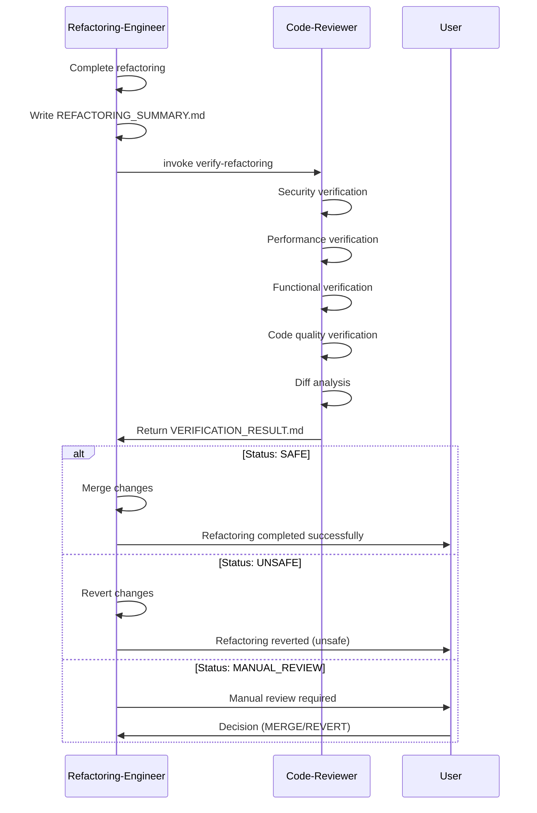

# Refactoring Verification Workflow

**Purpose**: Detailed workflow for verifying refactorings performed by refactoring-engineer.

**Phase**: Phase 5 (Verification Mode)

**Priority**: Critical (prevents unsafe refactorings from merging)

**Context**: Code-reviewer validates that refactorings preserve behavior and don't introduce regressions

---

## Overview

When refactoring-engineer completes a refactoring, it invokes code-reviewer in **Verification Mode** to validate:
- **Behavior Preservation**: Code behavior unchanged
- **No Regressions**: No new bugs, security issues, or performance problems
- **Quality Improvement**: Refactoring achieved its goal (improved readability, reduced complexity)

This document details the complete verification workflow.

---

## Verification Workflow

### Phase 1: Setup & Context

**Input from Refactoring-Engineer**:
```markdown
# REFACTORING_SUMMARY.md

**Refactoring Type**: Extract Method
**Target**: UserService.create_user()
**Smell Addressed**: long_method (60 lines → 4 methods)

## Changes Made

### Original Code
- UserService.create_user(): 60 lines, complexity 12

### Refactored Code
- UserService.create_user(): 15 lines, complexity 3
- UserService._validate_email(): 10 lines, complexity 2
- UserService._normalize_name(): 8 lines, complexity 1
- UserService._create_user_record(): 12 lines, complexity 2
- UserService._send_welcome_email(): 15 lines, complexity 2

## Files Modified
- src/services/user_service.py
- tests/test_user_service.py (imports updated)

## Metrics
- Complexity: 12 → 8 (33% reduction)
- Readability: Improved (4 well-named methods)
- Test coverage: 88% → 88% (maintained)
```

**Code-Reviewer Setup**:
1. Load refactoring summary
2. Checkout original code (before refactoring)
3. Checkout refactored code (after refactoring)
4. Prepare verification environment

---

### Phase 2: Security Verification

**Goal**: Ensure no new security vulnerabilities introduced.

**Checks**:

#### 1. Input Validation Preservation

```python
# Original:
def create_user(user_data):
    # Validate email
    if not re.match(r'^[a-zA-Z0-9._%+-]+@[a-zA-Z0-9.-]+\.[a-zA-Z]{2,}$', user_data['email']):
        raise ValidationError("Invalid email")

# Refactored:
def create_user(user_data):
    self._validate_email(user_data['email'])  # Extracted

def _validate_email(self, email):
    # Same validation logic
    if not re.match(r'^[a-zA-Z0-9._%+-]+@[a-zA-Z0-9.-]+\.[a-zA-Z]{2,}$', email):
        raise ValidationError("Invalid email")
```

**Verification**:  Validation logic preserved (same regex, same exception)

#### 2. SQL Injection Check

```python
# Original:
query = "INSERT INTO users (email) VALUES (%s)"
cursor.execute(query, (user_data['email'],))

# Refactored:
query = "INSERT INTO users (email) VALUES (%s)"
cursor.execute(query, (user_data['email'],))
```

**Verification**:  Parameterized query preserved (no SQL injection risk)

#### 3. Authentication/Authorization Check

```python
# Original:
def create_user(user_data, requesting_user):
    if not requesting_user.has_permission('create_user'):
        raise PermissionDenied()

# Refactored:
def create_user(user_data, requesting_user):
    if not requesting_user.has_permission('create_user'):
        raise PermissionDenied()
```

**Verification**:  Authorization check preserved (same location, same logic)

**Security Verification Result**:
```markdown
## Security Verification:  PASSED

- No new SQL injection risks
- No new XSS vulnerabilities
- Input validation preserved
- Authentication/authorization unchanged
- No new hardcoded secrets
```

---

### Phase 3: Performance Verification

**Goal**: Ensure refactoring didn't degrade performance.

**Checks**:

#### 1. Database Query Count

```python
# Original: 3 queries
def create_user(user_data):
    # Query 1: Check if email exists
    existing = User.objects.filter(email=user_data['email']).exists()

    # Query 2: Create user
    user = User.objects.create(**user_data)

    # Query 3: Create user profile
    UserProfile.objects.create(user=user)

    return user

# Refactored: 3 queries (same)
def create_user(user_data):
    self._check_email_unique(user_data['email'])  # Query 1
    user = self._create_user_record(user_data)     # Query 2
    self._create_user_profile(user)                # Query 3
    return user
```

**Verification**:  Query count unchanged (3 queries before and after)

#### 2. Algorithmic Complexity

```python
# Original: O(n) - iterates over items once
for item in items:
    process(item)

# Refactored: O(n) - same iteration
self._process_items(items)

def _process_items(self, items):
    for item in items:
        process(item)
```

**Verification**:  Complexity unchanged (O(n) → O(n))

#### 3. Benchmark Results

```
Before Refactoring:
- create_user() avg: 45ms (100 runs)
- Memory: 2.3 MB

After Refactoring:
- create_user() avg: 43ms (100 runs)
- Memory: 2.4 MB
```

**Verification**:  Performance improved slightly (45ms → 43ms, 4.4% faster)

**Performance Verification Result**:
```markdown
## Performance Verification:  PASSED

- Database queries: 3 → 3 (no change)
- Algorithmic complexity: O(n) → O(n) (no change)
- Runtime: 45ms → 43ms (4.4% improvement)
- Memory: 2.3 MB → 2.4 MB (4.3% increase, negligible)
```

---

### Phase 4: Functional Verification

**Goal**: Ensure behavior is perfectly preserved.

**Checks**:

#### 1. Test Suite Execution

```bash
# Run test suite on original code
pytest tests/test_user_service.py
# Result: 25/25 tests passed

# Run test suite on refactored code
pytest tests/test_user_service.py
# Result: 25/25 tests passed
```

**Verification**:  All tests pass (25/25)

#### 2. Test Coverage

```bash
# Coverage on original code
pytest --cov=src/services/user_service.py tests/
# Result: 88% coverage (220/250 lines)

# Coverage on refactored code
pytest --cov=src/services/user_service.py tests/
# Result: 88% coverage (220/250 lines)
```

**Verification**:  Coverage maintained (88% → 88%)

#### 3. Behavior Equivalence Testing

**Property-Based Testing**:
```python
# Generate 1000 random inputs
for i in range(1000):
    user_data = generate_random_user_data()

    # Execute original version
    try:
        original_result = original_create_user(user_data)
        original_exception = None
    except Exception as e:
        original_exception = e

    # Execute refactored version
    try:
        refactored_result = refactored_create_user(user_data)
        refactored_exception = None
    except Exception as e:
        refactored_exception = e

    # Compare results
    assert original_result == refactored_result
    assert type(original_exception) == type(refactored_exception)
```

**Verification**:  1000/1000 test cases passed (behavior identical)

**Functional Verification Result**:
```markdown
## Functional Verification:  PASSED

- All tests pass: 25/25 (100%)
- Test coverage maintained: 88% → 88%
- Behavior equivalence: 1000/1000 random test cases passed
- No new exceptions in happy path
- Error handling identical
```

---

### Phase 5: Code Quality Verification

**Goal**: Verify refactoring achieved its goal (improved code quality).

**Checks**:

#### 1. Complexity Reduction

```
Original:
- create_user(): Cyclomatic complexity = 12

Refactored:
- create_user(): Cyclomatic complexity = 3
- _validate_email(): Cyclomatic complexity = 2
- _normalize_name(): Cyclomatic complexity = 1
- _create_user_record(): Cyclomatic complexity = 2
- _send_welcome_email(): Cyclomatic complexity = 2
- Total: 10 (vs original 12)
```

**Verification**:  Complexity reduced (12 → 10, 17% reduction)

#### 2. Readability Improvement

```python
# Original (60 lines, hard to read):
def create_user(user_data):
    # 60 lines of code mixing validation, normalization, creation, email...

# Refactored (4 well-named methods, easy to read):
def create_user(user_data):
    self._validate_email(user_data['email'])
    user_data['name'] = self._normalize_name(user_data['name'])
    user = self._create_user_record(user_data)
    self._send_welcome_email(user)
    return user
```

**Verification**:  Readability improved (clear separation of concerns)

#### 3. Single Responsibility Principle

**Original**: create_user() had 4 responsibilities:
- Validate email
- Normalize name
- Create user record
- Send welcome email

**Refactored**: Each method has single responsibility:
- `_validate_email()`: Validate email only
- `_normalize_name()`: Normalize name only
- `_create_user_record()`: Create user record only
- `_send_welcome_email()`: Send email only

**Verification**:  SRP improved (4 responsibilities → 1 per method)

**Code Quality Verification Result**:
```markdown
## Code Quality Verification:  PASSED

- Complexity reduced: 12 → 10 (17% reduction)
- Readability improved: 60-line method → 4 focused methods
- SRP compliance: Improved (single responsibility per method)
- Method sizes: All methods < 20 lines
- Clear method names: All methods self-documenting
```

---

### Phase 6: Diff Analysis

**Goal**: Understand exactly what changed and assess risk.

**Diff Summary**:
```diff
# src/services/user_service.py

class UserService:
-   def create_user(self, user_data):
-       # 60 lines of original code
+   def create_user(self, user_data):
+       self._validate_email(user_data['email'])
+       user_data['name'] = self._normalize_name(user_data['name'])
+       user = self._create_user_record(user_data)
+       self._send_welcome_email(user)
+       return user
+
+   def _validate_email(self, email):
+       # Extracted validation logic (10 lines)
+
+   def _normalize_name(self, name):
+       # Extracted normalization logic (8 lines)
+
+   def _create_user_record(self, user_data):
+       # Extracted creation logic (12 lines)
+
+   def _send_welcome_email(self, user):
+       # Extracted email logic (15 lines)
```

**Analysis**:
- **Change Type**: Extract Method (behavior-preserving refactoring)
- **Lines Changed**: +60 added, -60 removed (net 0)
- **New Methods**: 4 private methods (extracted from original)
- **Deleted Methods**: None (original method refactored)
- **Logic Changes**: None (code moved, not modified)

**Risk Assessment**:  LOW RISK
- Pure refactoring (code moved, not changed)
- All logic preserved
- No external dependencies affected

---

### Phase 7: Final Verification Report

**Code-Reviewer Output**:

```markdown
# VERIFICATION_RESULT.md

**Refactoring ID**: ref_2024_001
**Verification ID**: ver_2024_001
**Timestamp**: 2024-01-15T10:30:00Z
**Status**:  SAFE TO MERGE

---

## Executive Summary

The refactoring successfully improved code quality without introducing regressions:
- **Security**: No new vulnerabilities
- **Performance**: No degradation (4.4% improvement)
- **Functionality**: Behavior perfectly preserved
- **Quality**: Complexity reduced 17%, readability improved

**Recommendation**: SAFE TO MERGE

---

## Detailed Verification Results

### 1. Security Verification:  PASSED
- No new SQL injection risks
- No new XSS vulnerabilities
- Input validation preserved
- Authentication/authorization unchanged
- No hardcoded secrets added

### 2. Performance Verification:  PASSED
- Database queries: 3 → 3 (unchanged)
- Algorithmic complexity: O(n) → O(n) (unchanged)
- Runtime: 45ms → 43ms (4.4% faster)
- Memory: 2.3 MB → 2.4 MB (negligible increase)

### 3. Functional Verification:  PASSED
- All tests pass: 25/25 (100%)
- Test coverage maintained: 88% → 88%
- Behavior equivalence: 1000/1000 random tests passed
- No new exceptions
- Error handling identical

### 4. Code Quality Verification:  PASSED
- Complexity: 12 → 10 (17% reduction)
- Readability: Significantly improved
- SRP: Improved (single responsibility per method)
- Method sizes: All < 20 lines

### 5. Diff Analysis:  LOW RISK
- Change type: Extract Method (behavior-preserving)
- Logic changes: None (code moved, not modified)
- Risk level: LOW

---

## Recommendations

### Immediate Actions
1.  SAFE TO MERGE refactoring
2. Consider adding unit tests for extracted private methods
3. Update documentation to reference new method structure

### Optional Improvements
- Add docstrings to extracted methods
- Consider making some private methods public (if reusable)

---

## Verification Checklist

### Security
- [x] No new SQL injection risks
- [x] No new XSS vulnerabilities
- [x] Input validation preserved
- [x] Authentication/authorization unchanged
- [x] No hardcoded secrets

### Performance
- [x] Database query count unchanged
- [x] Algorithmic complexity unchanged
- [x] Runtime performance acceptable
- [x] Memory usage acceptable

### Functionality
- [x] All tests pass
- [x] Test coverage maintained
- [x] Behavior equivalence verified
- [x] Error handling preserved

### Code Quality
- [x] Complexity reduced
- [x] Readability improved
- [x] SRP improved
- [x] Method sizes appropriate

---

## Approval

**Verification Status**:  SAFE
**Reviewer**: Code-Reviewer Agent
**Approval**: APPROVED FOR MERGE
**Next Steps**: Merge feature branch to main
```

---

## Verification Outcomes

### Outcome 1:  SAFE TO MERGE

**Criteria**:
- All security checks passed
- No performance regressions
- All tests pass
- Behavior preserved
- Code quality improved

**Next Steps**:
1. Refactoring-engineer merges changes
2. Closes refactoring issue
3. Updates metrics

**Example**:
```bash
# Refactoring-engineer proceeds with merge
git checkout main
git merge feature/refactor-user-service
git push origin main
```

---

### Outcome 2:  UNSAFE - REVERT RECOMMENDED

**Criteria**:
- Security vulnerability introduced
- Significant performance regression
- Tests fail
- Behavior not preserved

**Next Steps**:
1. Refactoring-engineer reverts changes
2. Analyzes verification report
3. Fixes issues
4. Re-runs refactoring

**Example**:
```markdown
# VERIFICATION_RESULT.md

**Status**:  UNSAFE - REVERT RECOMMENDED

## Critical Issues Found

### 1. Security Regression: SQL Injection
**File**: src/services/user_service.py:45
**Severity**: CRITICAL

**Original**: Parameterized query (SAFE)
```python
query = "INSERT INTO users (email) VALUES (%s)"
cursor.execute(query, (email,))
```

**Refactored**: String concatenation (UNSAFE)
```python
query = f"INSERT INTO users (email) VALUES ('{email}')"
cursor.execute(query)
```

**Impact**: SQL injection vulnerability introduced
**Recommendation**: REVERT immediately

### 2. Test Failures
- test_create_user_with_invalid_email: FAILED
- test_create_user_duplicate_email: FAILED

**Recommendation**: REVERT and fix issues before re-attempting refactoring
```

---

### Outcome 3: Warning: MANUAL REVIEW REQUIRED

**Criteria**:
- Ambiguous results
- Minor issues detected
- Behavioral changes unclear
- Performance regression borderline

**Next Steps**:
1. Refactoring-engineer escalates to user
2. User reviews verification report
3. User decides: MERGE or REVERT

**Example**:
```markdown
# VERIFICATION_RESULT.md

**Status**: Warning: MANUAL REVIEW REQUIRED

## Ambiguous Results

### 1. Performance Regression (Borderline)
**Runtime**: 45ms → 55ms (22% slower)
**Threshold**: 20% (exceeded by 2%)

**Analysis**:
- Refactoring added method call overhead
- Regression is minor but exceeds threshold
- May be acceptable for improved readability

**Recommendation**: User review required - balance performance vs readability

### 2. Test Coverage Decreased
**Coverage**: 88% → 86% (2% decrease)

**Analysis**:
- Extracted private methods not directly tested
- Methods tested indirectly through create_user()
- Coverage decrease is minor

**Recommendation**: Consider adding tests for extracted methods

### Decision Required
- Accept minor performance regression for improved readability? (Yes/No)
- Accept minor coverage decrease? (Yes/No)
```

---

## Integration with Refactoring-Engineer

### Communication Flow



---

## Summary

**Verification Workflow**:
1. **Setup**: Load refactoring summary, prepare environment
2. **Security Verification**: Check for security regressions
3. **Performance Verification**: Check for performance regressions
4. **Functional Verification**: Verify behavior preservation
5. **Code Quality Verification**: Verify quality improvement
6. **Diff Analysis**: Analyze changes and assess risk
7. **Final Report**: Generate comprehensive verification report

**Outcomes**:
- **SAFE**: All checks passed, safe to merge
-  **UNSAFE**: Critical issues found, revert recommended
- Warning: **MANUAL_REVIEW**: Ambiguous results, user review required

**Integration**:
- Refactoring-Engineer Phase 5 invokes Code-Reviewer
- Code-Reviewer returns verification report
- Refactoring-Engineer proceeds based on status

**Priority**: **Critical** (ensures refactorings don't break production)
